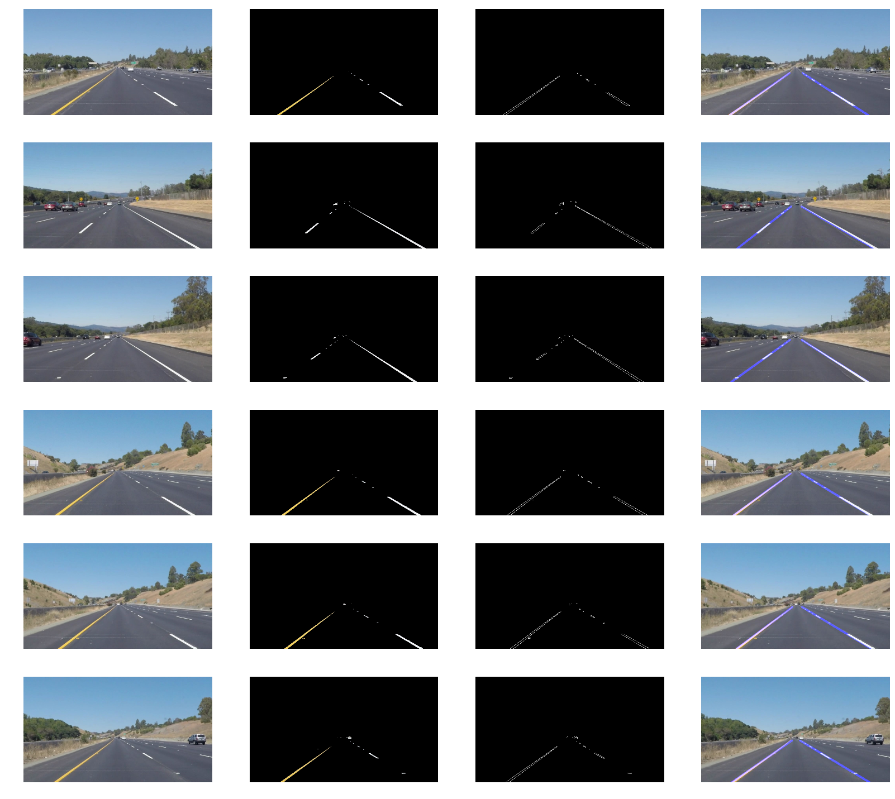

# Udacity SDCND - P1 Lane-Finding
My first project for the Udacity Self-driving Car Nanodegree, finding lane lines using Canny edge detection and the Hough transform.

# **Finding Lane Lines on the Road** 
***

## Test on Images

## Test on Videos

Let's try the one with the solid white lane on the right first ...

https://youtu.be/M9eXh16gSxM

https://youtu.be/Q4gycJoBKdo

## Optional Challenge

https://youtu.be/Wb_AaCSJJAo

